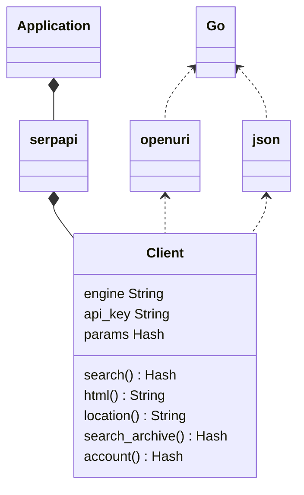
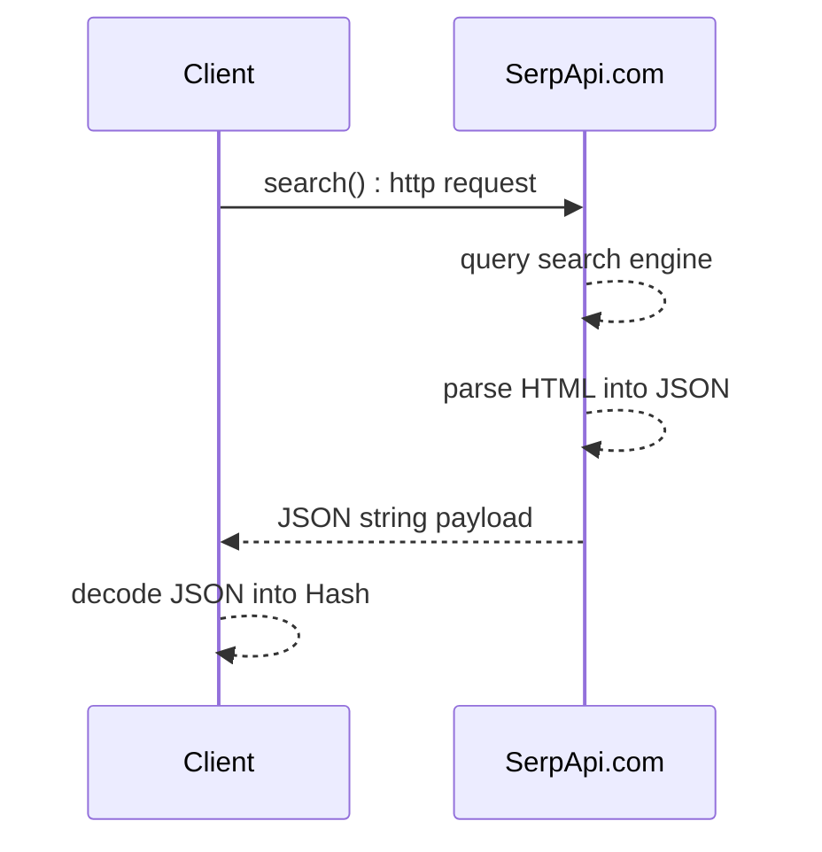

<div align="center">
<h1 align="center">SerpApi Go Library</h1>

[](https://github.com/serpapi/serpapi-golang/actions/workflows/go.yml)
</div>

Integrate search data into your Go application. This library is the official wrapper for [SerpApi](https://serpapi.com).

[SerpApi](https://serpapi.com) supports Google, Google Maps, Google Shopping, Baidu, Yandex, Yahoo, eBay, App Stores, and more.

## Installation

Go 1.10 is required. 

```bash
go get -u github.com/serpapi/serpapi-golang
```

## Simple Usage

```golang
import "github.com/serpapi/serpapi-golang"

client_parameter := map[string]string{
  "engine": "google",
  "api_key": "secret_api_key"
}
client := serpapi.NewClient(client_parameter)

parameter := map[string]string{ 
  "q": "coffee"
}
data, err := client.Search(parameter)
fmt.Println(data)
 ```

This example runs a search for "coffee" on Google. It then returns the results a Go Hash. See the [playground](https://serpapi.com/playground) to generate your own code.

## Advanced Usage
### Search API
```golang

func main() {
  // serpapi client created with default parameters
  client_parameter := map[string]string{
    "api_key": "secret_key",
    "timeout": "30",
    "engine":  "google",
  }
  client := serpapi.NewClient(client_parameter)

  // We recommend that you keep your keys safe.
  // At least, don't commit them in plain text.
  // More about configuration via environment variables:
  // https://hackernoon.com/all-the-secrets-of-encrypting-api-keys-in-golang-revealed-5qf3t5l

  // search query overview (more fields available depending on search engine)
  parameter := map[string]string{
    "q":             "Coffee",
    "location":      "Portland, Oregon, United States",
    "hl":            "en",
    "gl":            "us",
    "google_domain": "google.com",
    "safe":          "active",
    "start":         "10",
    "num":           "10",
    "device":        "desktop",
  }

  // formated search results as a Hash
  // serpapi.com converts HTML -> JSON
  rsp, err := client.Search(parameter)

  if err != nil {
    panic(err)
  }
  fmt.Println(rsp)

  // raw search engine html as a String
  // serpapi.com acts a proxy to provive high throughputs, no search limit and more.
  raw_html, err := client.Html(parameter)
  if err != nil { 
    panic(err)
  }
  fmt.Println(raw_html)
}
```

[Google search documentation](https://serpapi.com/search-api).
More hands on examples are available below.

#### Documentations

 * [Full documentation on SerpApi.com](https://serpapi.com)
 * [Library Github page](https://github.com/serpapi/serpapi-golang)
 * [API health status](https://serpapi.com/status)

### Location API

```golang
client := serpapi.NewClient(map[string]string{})
rsp, err := client.Location("Austin", 3)

if err != nil {
  panic(err)
}
fmt.Println(rsp)
```

it prints the first 3 locations matching Austin (Texas, Texas, Rochester)
```
[map[canonical_name:Austin,TX,Texas,United States country_code:US google_id:200635 google_parent_id:21176 gps:[-97.7430608 30.267153]...
```

NOTE: api_key is not required for this endpoint.

### Search Archive API

This API allows retrieving previous search results.
To fetch earlier results from the search_id.

First, you need to run a search and save the search id.
```golang
// First, you need to run a search and save the search id.
client_parameter := map[string]string{
  "engine":  "google",
  "api_key": "secret_api_key",
}
client := serpapi.NewClient(client_parameter)
parameter := map[string]string{
  "q":        "Coffee",
  "location": "Portland"}

rsp, err := client.Search(parameter)

if err != nil {
  t.Error("unexpected error", err)
  return
}

// Now let's retrieve the previous search results from the archive.
searchID := rsp["search_metadata"].(map[string]interface{})["id"].(string)
if len(searchID) == 0 {
  t.Error("search_metadata.id must be defined")
  return
}

searchArchive, err := client.SearchArchive(searchID)
if err != nil {
  t.Error(err)
  return
}

searchIDArchive := searchArchive["search_metadata"].(map[string]interface{})["id"].(string)
if searchIDArchive != searchID {
  t.Error("search_metadata.id do not match", searchIDArchive, searchID)
}
```

This code prints the search results from the archive. :)

### Account API
```golang
parameter := map[string]string{
 "api_key": "<secret_api_key>"
}
client := serpapi.NewClient(parameter)
rsp, err = client.Account()
fmt.Println(rsp)
```

It prints your account information.

## Basic examples in Go
### Search bing
```golang
 import (	
  "github.com/serpapi/serpapi-golang" 
  "fmt"
)

 func main() {

  client_parameter := map[string]string{
    "engine": "bing",
    "api_key": "secret_api_key",
  }
  client := serpapi.NewClient(client_parameter)

  parameter := map[string]string{ 
    "q": "coffee",
  }
  rsp, err := client.Search(parameter)

  if err != nil {
    fmt.Println("unexpected error", err)
    return
  }

  if rsp["search_metadata"].(map[string]interface{})["status"] != "Success" {
    fmt.Println("bad status")
    return
  }

  if len(rsp["organic_results"].([]interface{})) < 5 {
    fmt.Println("expect more than 5 organic_results") 
    return
  }
}  

```

 * source code: [test/example_search_bing_test.go](https://github.com/serpapi/serpapi-golang/blob/master/test/example_search_bing_test.go)
see: [https://serpapi.com/bing-search-api](https://serpapi.com/bing-search-api)

### Search baidu
```golang
 import (	
  "github.com/serpapi/serpapi-golang" 
  "fmt"
)

 func main() {

  client_parameter := map[string]string{
    "engine": "baidu",
    "api_key": "secret_api_key",
  }
  client := serpapi.NewClient(client_parameter)

  parameter := map[string]string{ 
    "q": "coffee",
  }
  rsp, err := client.Search(parameter)

  if err != nil {
    fmt.Println("unexpected error", err)
    return
  }

  if rsp["search_metadata"].(map[string]interface{})["status"] != "Success" {
    fmt.Println("bad status")
    return
  }

  if len(rsp["organic_results"].([]interface{})) < 5 {
    fmt.Println("expect more than 5 organic_results") 
    return
  }
}  

```

 * source code: [test/example_search_baidu_test.go](https://github.com/serpapi/serpapi-golang/blob/master/test/example_search_baidu_test.go)
see: [https://serpapi.com/baidu-search-api](https://serpapi.com/baidu-search-api)

### Search yahoo
```golang
 import (	
  "github.com/serpapi/serpapi-golang" 
  "fmt"
)

 func main() {

  client_parameter := map[string]string{
    "engine": "yahoo",
    "api_key": "secret_api_key",
  }
  client := serpapi.NewClient(client_parameter)

  parameter := map[string]string{ 
    "p": "coffee",
  }
  rsp, err := client.Search(parameter)

  if err != nil {
    fmt.Println("unexpected error", err)
    return
  }

  if rsp["search_metadata"].(map[string]interface{})["status"] != "Success" {
    fmt.Println("bad status")
    return
  }

  if len(rsp["organic_results"].([]interface{})) < 5 {
    fmt.Println("expect more than 5 organic_results") 
    return
  }
}  

```

 * source code: [test/example_search_yahoo_test.go](https://github.com/serpapi/serpapi-golang/blob/master/test/example_search_yahoo_test.go)
see: [https://serpapi.com/yahoo-search-api](https://serpapi.com/yahoo-search-api)

### Search youtube
```golang
 import (	
  "github.com/serpapi/serpapi-golang" 
  "fmt"
)

 func main() {

  client_parameter := map[string]string{
    "engine": "youtube",
    "api_key": "secret_api_key",
  }
  client := serpapi.NewClient(client_parameter)

  parameter := map[string]string{ 
    "search_query": "coffee",
  }
  rsp, err := client.Search(parameter)

  if err != nil {
    fmt.Println("unexpected error", err)
    return
  }

  if rsp["search_metadata"].(map[string]interface{})["status"] != "Success" {
    fmt.Println("bad status")
    return
  }

  if len(rsp["video_results"].([]interface{})) < 5 {
    fmt.Println("expect more than 5 video_results") 
    return
  }
}  

```

 * source code: [test/example_search_youtube_test.go](https://github.com/serpapi/serpapi-golang/blob/master/test/example_search_youtube_test.go)
see: [https://serpapi.com/youtube-search-api](https://serpapi.com/youtube-search-api)

### Search walmart
```golang
 import (	
  "github.com/serpapi/serpapi-golang" 
  "fmt"
)

 func main() {

  client_parameter := map[string]string{
    "engine": "walmart",
    "api_key": "secret_api_key",
  }
  client := serpapi.NewClient(client_parameter)

  parameter := map[string]string{ 
    "query": "coffee",
  }
  rsp, err := client.Search(parameter)

  if err != nil {
    fmt.Println("unexpected error", err)
    return
  }

  if rsp["search_metadata"].(map[string]interface{})["status"] != "Success" {
    fmt.Println("bad status")
    return
  }

  if len(rsp["organic_results"].([]interface{})) < 5 {
    fmt.Println("expect more than 5 organic_results") 
    return
  }
}  

```

 * source code: [test/example_search_walmart_test.go](https://github.com/serpapi/serpapi-golang/blob/master/test/example_search_walmart_test.go)
see: [https://serpapi.com/walmart-search-api](https://serpapi.com/walmart-search-api)

### Search ebay
```golang
 import (	
  "github.com/serpapi/serpapi-golang" 
  "fmt"
)

 func main() {

  client_parameter := map[string]string{
    "engine": "ebay",
    "api_key": "secret_api_key",
  }
  client := serpapi.NewClient(client_parameter)

  parameter := map[string]string{ 
    "_nkw": "coffee",
  }
  rsp, err := client.Search(parameter)

  if err != nil {
    fmt.Println("unexpected error", err)
    return
  }

  if rsp["search_metadata"].(map[string]interface{})["status"] != "Success" {
    fmt.Println("bad status")
    return
  }

  if len(rsp["organic_results"].([]interface{})) < 5 {
    fmt.Println("expect more than 5 organic_results") 
    return
  }
}  

```

 * source code: [test/example_search_ebay_test.go](https://github.com/serpapi/serpapi-golang/blob/master/test/example_search_ebay_test.go)
see: [https://serpapi.com/ebay-search-api](https://serpapi.com/ebay-search-api)

### Search naver
```golang
 import (	
  "github.com/serpapi/serpapi-golang" 
  "fmt"
)

 func main() {

  client_parameter := map[string]string{
    "engine": "naver",
    "api_key": "secret_api_key",
  }
  client := serpapi.NewClient(client_parameter)

  parameter := map[string]string{ 
    "query": "coffee",
  }
  rsp, err := client.Search(parameter)

  if err != nil {
    fmt.Println("unexpected error", err)
    return
  }

  if rsp["search_metadata"].(map[string]interface{})["status"] != "Success" {
    fmt.Println("bad status")
    return
  }

  if len(rsp["ads_results"].([]interface{})) < 5 {
    fmt.Println("expect more than 5 ads_results") 
    return
  }
}  

```

 * source code: [test/example_search_naver_test.go](https://github.com/serpapi/serpapi-golang/blob/master/test/example_search_naver_test.go)
see: [https://serpapi.com/naver-search-api](https://serpapi.com/naver-search-api)

### Search home depot
```golang
 import (	
  "github.com/serpapi/serpapi-golang" 
  "fmt"
)

 func main() {

  client_parameter := map[string]string{
    "engine": "home_depot",
    "api_key": "secret_api_key",
  }
  client := serpapi.NewClient(client_parameter)

  parameter := map[string]string{ 
    "q": "table",
  }
  rsp, err := client.Search(parameter)

  if err != nil {
    fmt.Println("unexpected error", err)
    return
  }

  if rsp["search_metadata"].(map[string]interface{})["status"] != "Success" {
    fmt.Println("bad status")
    return
  }

  if len(rsp["products"].([]interface{})) < 5 {
    fmt.Println("expect more than 5 products") 
    return
  }
}  

```

 * source code: [test/example_search_home_depot_test.go](https://github.com/serpapi/serpapi-golang/blob/master/test/example_search_home_depot_test.go)
see: [https://serpapi.com/home-depot-search-api](https://serpapi.com/home-depot-search-api)

### Search apple app store
```golang
 import (	
  "github.com/serpapi/serpapi-golang" 
  "fmt"
)

 func main() {

  client_parameter := map[string]string{
    "engine": "apple_app_store",
    "api_key": "secret_api_key",
  }
  client := serpapi.NewClient(client_parameter)

  parameter := map[string]string{ 
    "term": "coffee",
  }
  rsp, err := client.Search(parameter)

  if err != nil {
    fmt.Println("unexpected error", err)
    return
  }

  if rsp["search_metadata"].(map[string]interface{})["status"] != "Success" {
    fmt.Println("bad status")
    return
  }

  if len(rsp["organic_results"].([]interface{})) < 5 {
    fmt.Println("expect more than 5 organic_results") 
    return
  }
}  

```

 * source code: [test/example_search_apple_app_store_test.go](https://github.com/serpapi/serpapi-golang/blob/master/test/example_search_apple_app_store_test.go)
see: [https://serpapi.com/apple-app-store](https://serpapi.com/apple-app-store)

### Search duckduckgo
```golang
 import (	
  "github.com/serpapi/serpapi-golang" 
  "fmt"
)

 func main() {

  client_parameter := map[string]string{
    "engine": "duckduckgo",
    "api_key": "secret_api_key",
  }
  client := serpapi.NewClient(client_parameter)

  parameter := map[string]string{ 
    "q": "coffee",
  }
  rsp, err := client.Search(parameter)

  if err != nil {
    fmt.Println("unexpected error", err)
    return
  }

  if rsp["search_metadata"].(map[string]interface{})["status"] != "Success" {
    fmt.Println("bad status")
    return
  }

  if len(rsp["organic_results"].([]interface{})) < 5 {
    fmt.Println("expect more than 5 organic_results") 
    return
  }
}  

```

 * source code: [test/example_search_duckduckgo_test.go](https://github.com/serpapi/serpapi-golang/blob/master/test/example_search_duckduckgo_test.go)
see: [https://serpapi.com/duckduckgo-search-api](https://serpapi.com/duckduckgo-search-api)

### Search google
```golang
 import (	
  "github.com/serpapi/serpapi-golang" 
  "fmt"
)

 func main() {

  client_parameter := map[string]string{
    "engine": "google",
    "api_key": "secret_api_key",
  }
  client := serpapi.NewClient(client_parameter)

  parameter := map[string]string{ 
    "q": "coffee", 
    "engine": "google",
  }
  rsp, err := client.Search(parameter)

  if err != nil {
    fmt.Println("unexpected error", err)
    return
  }

  if rsp["search_metadata"].(map[string]interface{})["status"] != "Success" {
    fmt.Println("bad status")
    return
  }

  if len(rsp["organic_results"].([]interface{})) < 5 {
    fmt.Println("expect more than 5 organic_results") 
    return
  }
}  

```

 * source code: [test/example_search_google_test.go](https://github.com/serpapi/serpapi-golang/blob/master/test/example_search_google_test.go)
see: [https://serpapi.com/search-api](https://serpapi.com/search-api)

### Search google scholar
```golang
 import (	
  "github.com/serpapi/serpapi-golang" 
  "fmt"
)

 func main() {

  client_parameter := map[string]string{
    "engine": "google_scholar",
    "api_key": "secret_api_key",
  }
  client := serpapi.NewClient(client_parameter)

  parameter := map[string]string{ 
    "q": "coffee",
  }
  rsp, err := client.Search(parameter)

  if err != nil {
    fmt.Println("unexpected error", err)
    return
  }

  if rsp["search_metadata"].(map[string]interface{})["status"] != "Success" {
    fmt.Println("bad status")
    return
  }

  if len(rsp["organic_results"].([]interface{})) < 5 {
    fmt.Println("expect more than 5 organic_results") 
    return
  }
}  

```

 * source code: [test/example_search_google_scholar_test.go](https://github.com/serpapi/serpapi-golang/blob/master/test/example_search_google_scholar_test.go)
see: [https://serpapi.com/google-scholar-api](https://serpapi.com/google-scholar-api)

### Search google autocomplete
```golang
 import (	
  "github.com/serpapi/serpapi-golang" 
  "fmt"
)

 func main() {

  client_parameter := map[string]string{
    "engine": "google_autocomplete",
    "api_key": "secret_api_key",
  }
  client := serpapi.NewClient(client_parameter)

  parameter := map[string]string{ 
    "q": "coffee",
  }
  rsp, err := client.Search(parameter)

  if err != nil {
    fmt.Println("unexpected error", err)
    return
  }

  if rsp["search_metadata"].(map[string]interface{})["status"] != "Success" {
    fmt.Println("bad status")
    return
  }

  if len(rsp["suggestions"].([]interface{})) < 5 {
    fmt.Println("expect more than 5 suggestions") 
    return
  }
}  

```

 * source code: [test/example_search_google_autocomplete_test.go](https://github.com/serpapi/serpapi-golang/blob/master/test/example_search_google_autocomplete_test.go)
see: [https://serpapi.com/google-autocomplete-api](https://serpapi.com/google-autocomplete-api)

### Search google product
```golang
 import (	
  "github.com/serpapi/serpapi-golang" 
  "fmt"
)

 func main() {

  client_parameter := map[string]string{
    "engine": "google_product",
    "api_key": "secret_api_key",
  }
  client := serpapi.NewClient(client_parameter)

  parameter := map[string]string{ 
    "q": "coffee", 
    "product_id": "4887235756540435899",
  }
  rsp, err := client.Search(parameter)

  if err != nil {
    fmt.Println("unexpected error", err)
    return
  }

  if rsp["search_metadata"].(map[string]interface{})["status"] != "Success" {
    fmt.Println("bad status")
    return
  }

  if len(rsp["product_results"].(map[string]interface{})) < 5 {
    fmt.Println("expect more than  5 product_results")
    return
  }
}  

```

 * source code: [test/example_search_google_product_test.go](https://github.com/serpapi/serpapi-golang/blob/master/test/example_search_google_product_test.go)
see: [https://serpapi.com/google-product-api](https://serpapi.com/google-product-api)

### Search google reverse image
```golang
 import (	
  "github.com/serpapi/serpapi-golang" 
  "fmt"
)

 func main() {

  client_parameter := map[string]string{
    "engine": "google_reverse_image",
    "api_key": "secret_api_key",
  }
  client := serpapi.NewClient(client_parameter)

  parameter := map[string]string{ 
    "image_url": "https://i.imgur.com/5bGzZi7.jpg", 
    "max_results": "1",
  }
  rsp, err := client.Search(parameter)

  if err != nil {
    fmt.Println("unexpected error", err)
    return
  }

  if rsp["search_metadata"].(map[string]interface{})["status"] != "Success" {
    fmt.Println("bad status")
    return
  }

  if len(rsp["image_sizes"].([]interface{})) < 1 {
    fmt.Println("expect more than 1 image_sizes") 
    return
  }
}  

```

 * source code: [test/example_search_google_reverse_image_test.go](https://github.com/serpapi/serpapi-golang/blob/master/test/example_search_google_reverse_image_test.go)
see: [https://serpapi.com/google-reverse-image](https://serpapi.com/google-reverse-image)

### Search google events
```golang
 import (	
  "github.com/serpapi/serpapi-golang" 
  "fmt"
)

 func main() {

  client_parameter := map[string]string{
    "engine": "google_events",
    "api_key": "secret_api_key",
  }
  client := serpapi.NewClient(client_parameter)

  parameter := map[string]string{ 
    "q": "coffee",
  }
  rsp, err := client.Search(parameter)

  if err != nil {
    fmt.Println("unexpected error", err)
    return
  }

  if rsp["search_metadata"].(map[string]interface{})["status"] != "Success" {
    fmt.Println("bad status")
    return
  }

  if len(rsp["events_results"].([]interface{})) < 5 {
    fmt.Println("expect more than 5 events_results") 
    return
  }
}  

```

 * source code: [test/example_search_google_events_test.go](https://github.com/serpapi/serpapi-golang/blob/master/test/example_search_google_events_test.go)
see: [https://serpapi.com/google-events-api](https://serpapi.com/google-events-api)

### Search google local services
```golang
 import (	
  "github.com/serpapi/serpapi-golang" 
  "fmt"
)

 func main() {

  client_parameter := map[string]string{
    "engine": "google_local_services",
    "api_key": "secret_api_key",
  }
  client := serpapi.NewClient(client_parameter)

  parameter := map[string]string{ 
    "q": "electrician", 
    "data_cid": "6745062158417646970",
  }
  rsp, err := client.Search(parameter)

  if err != nil {
    fmt.Println("unexpected error", err)
    return
  }

  if rsp["search_metadata"].(map[string]interface{})["status"] != "Success" {
    fmt.Println("bad status")
    return
  }

  if len(rsp["local_ads"].([]interface{})) < 5 {
    fmt.Println("expect more than 5 local_ads") 
    return
  }
}  

```

 * source code: [test/example_search_google_local_services_test.go](https://github.com/serpapi/serpapi-golang/blob/master/test/example_search_google_local_services_test.go)
see: [https://serpapi.com/google-local-services-api](https://serpapi.com/google-local-services-api)

### Search google maps
```golang
 import (	
  "github.com/serpapi/serpapi-golang" 
  "fmt"
)

 func main() {

  client_parameter := map[string]string{
    "engine": "google_maps",
    "api_key": "secret_api_key",
  }
  client := serpapi.NewClient(client_parameter)

  parameter := map[string]string{ 
    "q": "pizza", 
    "ll": "@40.7455096,-74.0083012,15.1z", 
    "type": "search",
  }
  rsp, err := client.Search(parameter)

  if err != nil {
    fmt.Println("unexpected error", err)
    return
  }

  if rsp["search_metadata"].(map[string]interface{})["status"] != "Success" {
    fmt.Println("bad status")
    return
  }

  if len(rsp["local_results"].([]interface{})) < 5 {
    fmt.Println("expect more than 5 local_results") 
    return
  }
}  

```

 * source code: [test/example_search_google_maps_test.go](https://github.com/serpapi/serpapi-golang/blob/master/test/example_search_google_maps_test.go)
see: [https://serpapi.com/google-maps-api](https://serpapi.com/google-maps-api)

### Search google jobs
```golang
 import (	
  "github.com/serpapi/serpapi-golang" 
  "fmt"
)

 func main() {

  client_parameter := map[string]string{
    "engine": "google_jobs",
    "api_key": "secret_api_key",
  }
  client := serpapi.NewClient(client_parameter)

  parameter := map[string]string{ 
    "q": "coffee",
  }
  rsp, err := client.Search(parameter)

  if err != nil {
    fmt.Println("unexpected error", err)
    return
  }

  if rsp["search_metadata"].(map[string]interface{})["status"] != "Success" {
    fmt.Println("bad status")
    return
  }

  if len(rsp["jobs_results"].([]interface{})) < 5 {
    fmt.Println("expect more than 5 jobs_results") 
    return
  }
}  

```

 * source code: [test/example_search_google_jobs_test.go](https://github.com/serpapi/serpapi-golang/blob/master/test/example_search_google_jobs_test.go)
see: [https://serpapi.com/google-jobs-api](https://serpapi.com/google-jobs-api)

### Search google play
```golang
 import (	
  "github.com/serpapi/serpapi-golang" 
  "fmt"
)

 func main() {

  client_parameter := map[string]string{
    "engine": "google_play",
    "api_key": "secret_api_key",
  }
  client := serpapi.NewClient(client_parameter)

  parameter := map[string]string{ 
    "q": "kite", 
    "store": "apps", 
    "max_results": "2",
  }
  rsp, err := client.Search(parameter)

  if err != nil {
    fmt.Println("unexpected error", err)
    return
  }

  if rsp["search_metadata"].(map[string]interface{})["status"] != "Success" {
    fmt.Println("bad status")
    return
  }

  if len(rsp["organic_results"].([]interface{})) < 2 {
    fmt.Println("expect more than 2 organic_results") 
    return
  }
}  

```

 * source code: [test/example_search_google_play_test.go](https://github.com/serpapi/serpapi-golang/blob/master/test/example_search_google_play_test.go)
see: [https://serpapi.com/google-play-api](https://serpapi.com/google-play-api)


## Advanced search API usage
### Highly scalable batching

Search API features non-blocking search using the option: `async=true`.
 - Non-blocking - async=true - a single parent process can handle unlimited concurrent searches.
 - Blocking - async=false - many processes must be forked and synchronized to handle concurrent searches. This strategy is I/O usage because each client would hold a network connection.

Search API enables `async` search.
 - Non-blocking (`async=true`) : the development is more complex, but this allows handling many simultaneous connections.
 - Blocking (`async=false`) : it's easy to write the code but more compute-intensive when the parent process needs to hold many connections.

Here is an example of asynchronous searches using Go 
```golang
 import (	
  "github.com/serpapi/serpapi-golang" 
  "fmt"
)

 func main() {

import (
	"fmt"
	"os"

	serpapi "github.com/serpapi/serpapi-golang"
)

/***
 * Demonstrate how to run a search on Google.
 *
 * go get -u github.com/serpapi/serpapi-golang
 */
func main() {
	api_key := os.Getenv("API_KEY")
	if len(api_key) == 0 {
		println("you must obtain an api_key from serpapi\n and set the environment variable API_KEY\n $ export API_KEY='secret api key'")
	}
	client_parameter := map[string]string{
		"api_key": api_key,
		"engine":  "google",
	}
	client := serpapi.NewClient(client_parameter)
	parameter := map[string]string{
		"q":        "Coffee",
		"location": "Austin,Texas",
	}
	fmt.Println("search is running")
	data, err := client.Search(parameter)
	if err != nil {
		panic(err)
	}
	// decode data and display the first organic result title
	results := data["organic_results"].([]interface{})
	fmt.Println("search first result:")
	firstResult := results[0].(map[string]interface{})
	fmt.Println(firstResult["title"].(string))
	fmt.Println("ok: oobt test passed")
}

```

 * source code: [oobt/demo.go](https://github.com/serpapi/serpapi-golang/blob/master/oobt/demo.go)

This code shows a simple solution to batch searches asynchronously into a [queue](https://en.wikipedia.org/wiki/Queue_(abstract_data_type)). 
Each search takes a few seconds before completion by SerpApi service and the search engine. By the time the first element pops out of the queue. The search result might be already available in the archive. If not, the `search_archive` method blocks until the search results are available. 

## Supported Go version.
Go versions validated by Github Actions:
 - 3.1
 - 2.6
see: [Github Actions.](https://github.com/serpapi/serpapi-golang/actions/workflows/ci.yml)

## Change logs
 * [2023-09-01] 1.0.0 Full API support

## Developer Guide
### Key goals
 - Brand centric instead of search engine based
   - No hard-coded logic per search engine
 - Simple HTTP client (lightweight, reduced dependency)
   - No magic default values
   - Thread safe
 - Easy extension
 - Defensive code style (raise a custom exception)
 - TDD
 - Best API coding practice per platform
 - KiSS principles

### Inspirations
This project source code and coding style was inspired by Go itself.
This programming language native provides all the recommendation to build awesome software.

### Code quality expectations
 - 0 lint offense: `make lint`
 - 100% tests passing: `make test`
 - 100% code coverage: `make test`

# Developer Guide
## Design : UML diagram
### Class diagram

### search() : Sequence diagram

where:
  - The end user implements the application.
  - Client refers to SerpApi:Client.
  - SerpApi.com is the backend HTTP / REST service.
  - Engine refers to Google, Baidu, Bing, and more.

The SerpApi.com service (backend)
 - executes a scalable search on `engine: "google"` using the search query: `q: "coffee"`.
 - parses the messy HTML responses from Google on the backend.
 - returns a standardized JSON response.
The class SerpApi::Client (client side / golang):
 - Format the request to SerpApi.com server.
 - Execute HTTP Get request.
 - Parse JSON into Go Hash using a standard JSON library.
Et voila!

## Continuous integration
We love "true open source" and "continuous integration", and Test Drive Development (TDD).
 We are using RSpec to test [our infrastructure around the clock]) using Github Action to achieve the best QoS (Quality Of Service).

The directory spec/ includes specification which serves the dual purposes of examples and functional tests.

Set your secret API key in your shell before running a test.
```bash
export API_KEY="your_secret_key"
```
Install testing dependency
```bash
$ make
```
Contributions are welcome. Feel to submit a pull request!

## License

MIT License.