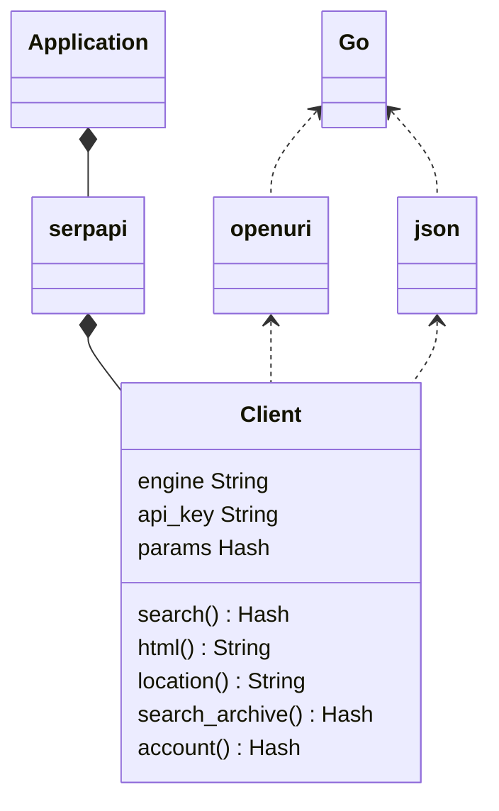
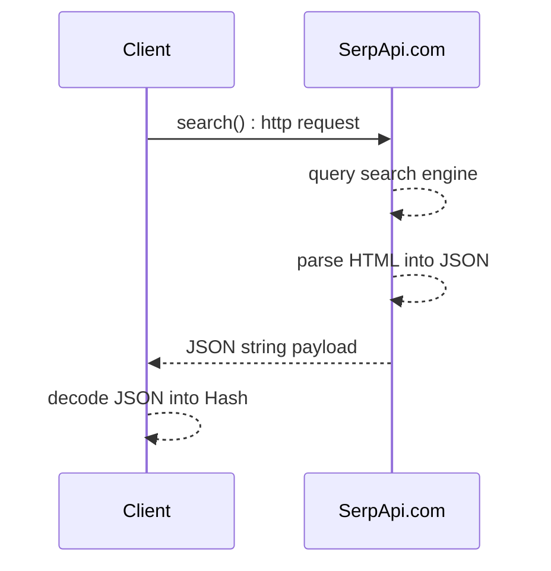

## SerpApi Go Library

[](https://github.com/serpapi/serpapi-golang/actions/workflows/ci.yml)
</div>

Integrate search data into your Go application. This library is the official wrapper for [SerpApi](https://serpapi.com).

[SerpApi](https://serpapi.com) supports Google, Google Maps, Google Shopping, Baidu, Yandex, Yahoo, eBay, App Stores, and more.

## Installation

Go 1.10 is required. 

```bash
go get -u github.com/serpapi/serpapi-golang
```

## Simple Usage

```golang
import "github.com/serpapi/serpapi-golang"
setting := serpapi.NewSerpApiClientSetting("<SERPAPI_KEY>") // Replace with your SerpApi key
setting.Engine = "google" // Set the search engine to Google
client := serpapi.NewClient(setting)
parameter := map[string]string{
  "q":             "Coffee",
  "location":      "Austin, Texas, United States",
}
results, err := client.Search(parameter)
fmt.Println(results)
 ```

This example runs a search for "coffee" on Google. It then returns the results a Go Hash. 
See the [playground](https://serpapi.com/playground) to generate your own code.

## Advanced Usage
### Search API
```golang

func main() {
  // Initialize the client with custom setting
	setting := serpapi.NewSerpApiClientSetting(os.Getenv("SERPAPI_KEY")) // Replace with your SerpApi key
	setting.Persistent = false                     // Enable persistent search
	setting.Asynchronous = true                    // Enable asynchronous search
	setting.Timeout = 60 * time.Second             // Set timeout for HTTP requests
	setting.MaxIdleConnection = 10                 // Set maximum idle connections
	setting.KeepAlive = 60 * time.Second           // Set keep-alive duration
	setting.TLSHandshakeTimeout = 10 * time.Second // Set TLS handshake timeout

	client := serpapi.NewClient(setting)

  // search query overview (more fields available depending on search engine)
  parameter := map[string]string{
    "q":             "Coffee",
    "location":      "Portland, Oregon, United States",
    "hl":            "en",
    "gl":            "us",
    "google_domain": "google.com",
    "safe":          "active",
    "start":         "10",
    "num":           "10",
    "device":        "desktop",
  }

  // formated search results as a Hash
  // serpapi.com converts HTML -> JSON
  rsp, err := client.Search(parameter)

  if err != nil {
    panic(err)
  }
  fmt.Println(rsp)

  // raw search engine html as a String
  // serpapi.com acts a proxy to provive high throughputs, no search limit and more.
  raw_html, err := client.Html(parameter)
  if err != nil { 
    panic(err)
  }
  fmt.Println(raw_html)
}
```

[Google search documentation](https://serpapi.com/search-api).
More hands on examples are available below.

#### Documentations

 * [Full documentation on SerpApi.com](https://serpapi.com)
 * [Library Github page](https://github.com/serpapi/serpapi-golang)
 * [API health status](https://serpapi.com/status)

### Location API

```golang
client := serpapi.NewClient(map[string]string{})
rsp, err := client.Location("Austin", 3)

if err != nil {
  panic(err)
}
fmt.Println(rsp)
```

it prints the first 3 locations matching Austin (Texas, Texas, Rochester)
```
[map[canonical_name:Austin,TX,Texas,United States country_code:US google_id:200635 google_parent_id:21176 gps:[-97.7430608 30.267153]...
```

NOTE: api_key is not required for this endpoint.

### Search Archive API

This API allows retrieving previous search results.
To fetch earlier results from the search_id.

First, you need to run a search and save the search id.
```golang
// First, you need to run a search and save the search id.
auth := map[string]string{
  "engine":  "google",
  "api_key": "secret_api_key",
}
client := serpapi.NewClient(auth)
parameter := map[string]string{
  "q":        "Coffee",
  "location": "Portland"}

rsp, err := client.Search(parameter)

if err != nil {
  t.Error("unexpected error", err)
  return
}

// Now let's retrieve the previous search results from the archive.
searchID := rsp["search_metadata"].(map[string]interface{})["id"].(string)
if len(searchID) == 0 {
  t.Error("search_metadata.id must be defined")
  return
}

searchArchive, err := client.SearchArchive(searchID)
if err != nil {
  t.Error(err)
  return
}

searchIDArchive := searchArchive["search_metadata"].(map[string]interface{})["id"].(string)
if searchIDArchive != searchID {
  t.Error("search_metadata.id do not match", searchIDArchive, searchID)
}
```

This code prints the search results from the archive. :)

### Account API
```golang
auth := map[string]string{
 "api_key": "<secret_api_key>"
}
client := serpapi.NewClient(auth)
rsp, err = client.Account()
fmt.Println(rsp)
```

It prints your account information.

## Basic examples in Go

### Search google
```golang
 import (	
  "github.com/serpapi/serpapi-golang" 
  "fmt"
)

 func main() {

  auth := map[string]string{
    "api_key": "secret_api_key",
  }
  client := serpapi.NewClient(auth)

  parameter := map[string]string{
    "engine": "google", 
    "q": "coffee",  }
  rsp, err := client.Search(parameter)

  if err != nil {
    fmt.Println("unexpected error", err)
    return
  }

  if rsp["search_metadata"].(map[string]interface{})["status"] != "Success" {
    fmt.Println("bad status")
    return
  }

  if rsp["organic_results"] == nil {
    fmt.Println("key is not found: organic_results")
    return 
  }

  if len(rsp["organic_results"].([]interface{})) < 5 {
    fmt.Println("expect more than 5 organic_results") 
    return
  }
}  

```

 * source code: [test/example/example_search_google_test.go](https://github.com/serpapi/serpapi-golang/blob/master/test/example/example_search_google_test.go)
* see: [serpapi.com/search-api](https://serpapi.com/search-api)

### Search google light
```golang
 import (	
  "github.com/serpapi/serpapi-golang" 
  "fmt"
)

 func main() {

  auth := map[string]string{
    "api_key": "secret_api_key",
  }
  client := serpapi.NewClient(auth)

  parameter := map[string]string{
    "engine": "google_light", 
    "q": "coffee",  }
  rsp, err := client.Search(parameter)

  if err != nil {
    fmt.Println("unexpected error", err)
    return
  }

  if rsp["search_metadata"].(map[string]interface{})["status"] != "Success" {
    fmt.Println("bad status")
    return
  }

  if rsp["organic_results"] == nil {
    fmt.Println("key is not found: organic_results")
    return 
  }

  if len(rsp["organic_results"].([]interface{})) < 5 {
    fmt.Println("expect more than 5 organic_results") 
    return
  }
}  

```

 * source code: [test/example/example_search_google_light_test.go](https://github.com/serpapi/serpapi-golang/blob/master/test/example/example_search_google_light_test.go)
* see: [serpapi.com/google-light-api](https://serpapi.com/google-light-api)

### Search google scholar
```golang
 import (	
  "github.com/serpapi/serpapi-golang" 
  "fmt"
)

 func main() {

  auth := map[string]string{
    "api_key": "secret_api_key",
  }
  client := serpapi.NewClient(auth)

  parameter := map[string]string{
    "engine": "google_scholar", 
    "q": "biology",  }
  rsp, err := client.Search(parameter)

  if err != nil {
    fmt.Println("unexpected error", err)
    return
  }

  if rsp["search_metadata"].(map[string]interface{})["status"] != "Success" {
    fmt.Println("bad status")
    return
  }

  if rsp["organic_results"] == nil {
    fmt.Println("key is not found: organic_results")
    return 
  }

  if len(rsp["organic_results"].([]interface{})) < 5 {
    fmt.Println("expect more than 5 organic_results") 
    return
  }
}  

```

 * source code: [test/example/example_search_google_scholar_test.go](https://github.com/serpapi/serpapi-golang/blob/master/test/example/example_search_google_scholar_test.go)
* see: [serpapi.com/google-scholar-api](https://serpapi.com/google-scholar-api)

### Search google autocomplete
```golang
 import (	
  "github.com/serpapi/serpapi-golang" 
  "fmt"
)

 func main() {

  auth := map[string]string{
    "api_key": "secret_api_key",
  }
  client := serpapi.NewClient(auth)

  parameter := map[string]string{
    "engine": "google_autocomplete", 
    "q": "coffee",  }
  rsp, err := client.Search(parameter)

  if err != nil {
    fmt.Println("unexpected error", err)
    return
  }

  if rsp["search_metadata"].(map[string]interface{})["status"] != "Success" {
    fmt.Println("bad status")
    return
  }

  if rsp["suggestions"] == nil {
    fmt.Println("key is not found: suggestions")
    return 
  }

  if len(rsp["suggestions"].([]interface{})) < 5 {
    fmt.Println("expect more than 5 suggestions") 
    return
  }
}  

```

 * source code: [test/example/example_search_google_autocomplete_test.go](https://github.com/serpapi/serpapi-golang/blob/master/test/example/example_search_google_autocomplete_test.go)
* see: [serpapi.com/google-autocomplete-api](https://serpapi.com/google-autocomplete-api)

### Search google product
```golang
 import (	
  "github.com/serpapi/serpapi-golang" 
  "fmt"
)

 func main() {

  auth := map[string]string{
    "api_key": "secret_api_key",
  }
  client := serpapi.NewClient(auth)

  parameter := map[string]string{
    "engine": "google_product", 
    "q": "coffee", 
    "product_id": "4887235756540435899",  }
  rsp, err := client.Search(parameter)

  if err != nil {
    fmt.Println("unexpected error", err)
    return
  }

  if rsp["search_metadata"].(map[string]interface{})["status"] != "Success" {
    fmt.Println("bad status")
    return
  }

  if rsp["product_results"] == nil {
    fmt.Println("key is not found: product_results")
    return 
  }

  if len(rsp["product_results"].(map[string]interface{})) < 5 {
    fmt.Println("expect more than  5 product_results")
    return
  }
}  

```

 * source code: [test/example/example_search_google_product_test.go](https://github.com/serpapi/serpapi-golang/blob/master/test/example/example_search_google_product_test.go)
* see: [serpapi.com/google-product-api](https://serpapi.com/google-product-api)

### Search google reverse image
```golang
 import (	
  "github.com/serpapi/serpapi-golang" 
  "fmt"
)

 func main() {

  auth := map[string]string{
    "api_key": "secret_api_key",
  }
  client := serpapi.NewClient(auth)

  parameter := map[string]string{
    "engine": "google_reverse_image", 
    "image_url": "https://i.imgur.com/5bGzZi7.jpg",  }
  rsp, err := client.Search(parameter)

  if err != nil {
    fmt.Println("unexpected error", err)
    return
  }

  if rsp["search_metadata"].(map[string]interface{})["status"] != "Success" {
    fmt.Println("bad status")
    return
  }

  if rsp["image_sizes"] == nil {
    fmt.Println("key is not found: image_sizes")
    return 
  }

  if len(rsp["image_sizes"].([]interface{})) < 1 {
    fmt.Println("expect more than 1 image_sizes") 
    return
  }
}  

```

 * source code: [test/example/example_search_google_reverse_image_test.go](https://github.com/serpapi/serpapi-golang/blob/master/test/example/example_search_google_reverse_image_test.go)
* see: [serpapi.com/google-reverse-image](https://serpapi.com/google-reverse-image)

### Search google events
```golang
 import (	
  "github.com/serpapi/serpapi-golang" 
  "fmt"
)

 func main() {

  auth := map[string]string{
    "api_key": "secret_api_key",
  }
  client := serpapi.NewClient(auth)

  parameter := map[string]string{
    "engine": "google_events", 
    "q": "coffee",  }
  rsp, err := client.Search(parameter)

  if err != nil {
    fmt.Println("unexpected error", err)
    return
  }

  if rsp["search_metadata"].(map[string]interface{})["status"] != "Success" {
    fmt.Println("bad status")
    return
  }

  if rsp["events_results"] == nil {
    fmt.Println("key is not found: events_results")
    return 
  }

  if len(rsp["events_results"].([]interface{})) < 5 {
    fmt.Println("expect more than 5 events_results") 
    return
  }
}  

```

 * source code: [test/example/example_search_google_events_test.go](https://github.com/serpapi/serpapi-golang/blob/master/test/example/example_search_google_events_test.go)
* see: [serpapi.com/google-events-api](https://serpapi.com/google-events-api)

### Search google local services
```golang
 import (	
  "github.com/serpapi/serpapi-golang" 
  "fmt"
)

 func main() {

  auth := map[string]string{
    "api_key": "secret_api_key",
  }
  client := serpapi.NewClient(auth)

  parameter := map[string]string{
    "engine": "google_local_services", 
    "q": "electrician", 
    "data_cid": "6745062158417646970",  }
  rsp, err := client.Search(parameter)

  if err != nil {
    fmt.Println("unexpected error", err)
    return
  }

  if rsp["search_metadata"].(map[string]interface{})["status"] != "Success" {
    fmt.Println("bad status")
    return
  }

  if rsp["local_ads"] == nil {
    fmt.Println("key is not found: local_ads")
    return 
  }

  if len(rsp["local_ads"].([]interface{})) < 5 {
    fmt.Println("expect more than 5 local_ads") 
    return
  }
}  

```

 * source code: [test/example/example_search_google_local_services_test.go](https://github.com/serpapi/serpapi-golang/blob/master/test/example/example_search_google_local_services_test.go)
* see: [serpapi.com/google-local-services-api](https://serpapi.com/google-local-services-api)

### Search google maps
```golang
 import (	
  "github.com/serpapi/serpapi-golang" 
  "fmt"
)

 func main() {

  auth := map[string]string{
    "api_key": "secret_api_key",
  }
  client := serpapi.NewClient(auth)

  parameter := map[string]string{
    "engine": "google_maps", 
    "q": "Coffee", 
    "ll": "@40.7455096,-74.0083012,14z", 
    "type": "search",  }
  rsp, err := client.Search(parameter)

  if err != nil {
    fmt.Println("unexpected error", err)
    return
  }

  if rsp["search_metadata"].(map[string]interface{})["status"] != "Success" {
    fmt.Println("bad status")
    return
  }

  if rsp["local_results"] == nil {
    fmt.Println("key is not found: local_results")
    return 
  }

  if len(rsp["local_results"].([]interface{})) < 5 {
    fmt.Println("expect more than 5 local_results") 
    return
  }
}  

```

 * source code: [test/example/example_search_google_maps_test.go](https://github.com/serpapi/serpapi-golang/blob/master/test/example/example_search_google_maps_test.go)
* see: [serpapi.com/google-maps-api](https://serpapi.com/google-maps-api)

### Search google jobs
```golang
 import (	
  "github.com/serpapi/serpapi-golang" 
  "fmt"
)

 func main() {

  auth := map[string]string{
    "api_key": "secret_api_key",
  }
  client := serpapi.NewClient(auth)

  parameter := map[string]string{
    "engine": "google_jobs", 
    "q": "coffee",  }
  rsp, err := client.Search(parameter)

  if err != nil {
    fmt.Println("unexpected error", err)
    return
  }

  if rsp["search_metadata"].(map[string]interface{})["status"] != "Success" {
    fmt.Println("bad status")
    return
  }

  if rsp["jobs_results"] == nil {
    fmt.Println("key is not found: jobs_results")
    return 
  }

  if len(rsp["jobs_results"].([]interface{})) < 5 {
    fmt.Println("expect more than 5 jobs_results") 
    return
  }
}  

```

 * source code: [test/example/example_search_google_jobs_test.go](https://github.com/serpapi/serpapi-golang/blob/master/test/example/example_search_google_jobs_test.go)
* see: [serpapi.com/google-jobs-api](https://serpapi.com/google-jobs-api)

### Search google play
```golang
 import (	
  "github.com/serpapi/serpapi-golang" 
  "fmt"
)

 func main() {

  auth := map[string]string{
    "api_key": "secret_api_key",
  }
  client := serpapi.NewClient(auth)

  parameter := map[string]string{
    "engine": "google_play", 
    "q": "kite", 
    "store": "apps",  }
  rsp, err := client.Search(parameter)

  if err != nil {
    fmt.Println("unexpected error", err)
    return
  }

  if rsp["search_metadata"].(map[string]interface{})["status"] != "Success" {
    fmt.Println("bad status")
    return
  }

  if rsp["organic_results"] == nil {
    fmt.Println("key is not found: organic_results")
    return 
  }

  if len(rsp["organic_results"].([]interface{})) < 1 {
    fmt.Println("expect more than 1 organic_results") 
    return
  }
}  

```

 * source code: [test/example/example_search_google_play_test.go](https://github.com/serpapi/serpapi-golang/blob/master/test/example/example_search_google_play_test.go)
* see: [serpapi.com/google-play-api](https://serpapi.com/google-play-api)

### Search google images
```golang
 import (	
  "github.com/serpapi/serpapi-golang" 
  "fmt"
)

 func main() {

  auth := map[string]string{
    "api_key": "secret_api_key",
  }
  client := serpapi.NewClient(auth)

  parameter := map[string]string{
    "engine": "google_images", 
    "tbm": "isch", 
    "q": "coffee",  }
  rsp, err := client.Search(parameter)

  if err != nil {
    fmt.Println("unexpected error", err)
    return
  }

  if rsp["search_metadata"].(map[string]interface{})["status"] != "Success" {
    fmt.Println("bad status")
    return
  }

  if rsp["images_results"] == nil {
    fmt.Println("key is not found: images_results")
    return 
  }

  if len(rsp["images_results"].([]interface{})) < 5 {
    fmt.Println("expect more than 5 images_results") 
    return
  }
}  

```

 * source code: [test/example/example_search_google_images_test.go](https://github.com/serpapi/serpapi-golang/blob/master/test/example/example_search_google_images_test.go)
* see: [serpapi.com/images-results](https://serpapi.com/images-results)

### Search google lens
```golang
 import (	
  "github.com/serpapi/serpapi-golang" 
  "fmt"
)

 func main() {

  auth := map[string]string{
    "api_key": "secret_api_key",
  }
  client := serpapi.NewClient(auth)

  parameter := map[string]string{
    "engine": "google_lens", 
    "url": "https://i.imgur.com/HBrB8p0.png",  }
  rsp, err := client.Search(parameter)

  if err != nil {
    fmt.Println("unexpected error", err)
    return
  }

  if rsp["search_metadata"].(map[string]interface{})["status"] != "Success" {
    fmt.Println("bad status")
    return
  }

  if rsp["visual_matches"] == nil {
    fmt.Println("key is not found: visual_matches")
    return 
  }

  if len(rsp["visual_matches"].([]interface{})) < 5 {
    fmt.Println("expect more than 5 visual_matches") 
    return
  }
}  

```

 * source code: [test/example/example_search_google_lens_test.go](https://github.com/serpapi/serpapi-golang/blob/master/test/example/example_search_google_lens_test.go)
* see: [serpapi.com/google-lens-api](https://serpapi.com/google-lens-api)

### Search google images light
```golang
 import (	
  "github.com/serpapi/serpapi-golang" 
  "fmt"
)

 func main() {

  auth := map[string]string{
    "api_key": "secret_api_key",
  }
  client := serpapi.NewClient(auth)

  parameter := map[string]string{
    "engine": "google_images_light", 
    "q": "Coffee",  }
  rsp, err := client.Search(parameter)

  if err != nil {
    fmt.Println("unexpected error", err)
    return
  }

  if rsp["search_metadata"].(map[string]interface{})["status"] != "Success" {
    fmt.Println("bad status")
    return
  }

  if rsp["images_results"] == nil {
    fmt.Println("key is not found: images_results")
    return 
  }

  if len(rsp["images_results"].([]interface{})) < 5 {
    fmt.Println("expect more than 5 images_results") 
    return
  }
}  

```

 * source code: [test/example/example_search_google_images_light_test.go](https://github.com/serpapi/serpapi-golang/blob/master/test/example/example_search_google_images_light_test.go)
* see: [serpapi.com/google-images-light-api](https://serpapi.com/google-images-light-api)

### Search google hotels
```golang
 import (	
  "github.com/serpapi/serpapi-golang" 
  "fmt"
)

 func main() {

  auth := map[string]string{
    "api_key": "secret_api_key",
  }
  client := serpapi.NewClient(auth)

  parameter := map[string]string{
    "engine": "google_hotels", 
    "q": "Bali Resorts", 
    "check_in_date": "2025-05-26", 
    "check_out_date": "2025-05-27", 
    "adults": "2", 
    "currency": "USD", 
    "gl": "us", 
    "hl": "en",  }
  rsp, err := client.Search(parameter)

  if err != nil {
    fmt.Println("unexpected error", err)
    return
  }

  if rsp["search_metadata"].(map[string]interface{})["status"] != "Success" {
    fmt.Println("bad status")
    return
  }

  if rsp["properties"] == nil {
    fmt.Println("key is not found: properties")
    return 
  }

  if len(rsp["properties"].([]interface{})) < 5 {
    fmt.Println("expect more than 5 properties") 
    return
  }
}  

```

 * source code: [test/example/example_search_google_hotels_test.go](https://github.com/serpapi/serpapi-golang/blob/master/test/example/example_search_google_hotels_test.go)
* see: [serpapi.com/google-hotels-api](https://serpapi.com/google-hotels-api)

### Search google flights
```golang
 import (	
  "github.com/serpapi/serpapi-golang" 
  "fmt"
)

 func main() {

  auth := map[string]string{
    "api_key": "secret_api_key",
  }
  client := serpapi.NewClient(auth)

  parameter := map[string]string{
    "engine": "google_flights", 
    "departure_id": "PEK", 
    "arrival_id": "AUS", 
    "outbound_date": "2025-05-26", 
    "return_date": "2025-06-01", 
    "currency": "USD", 
    "hl": "en",  }
  rsp, err := client.Search(parameter)

  if err != nil {
    fmt.Println("unexpected error", err)
    return
  }

  if rsp["search_metadata"].(map[string]interface{})["status"] != "Success" {
    fmt.Println("bad status")
    return
  }

  if rsp["best_flights"] == nil {
    fmt.Println("key is not found: best_flights")
    return 
  }

  if len(rsp["best_flights"].([]interface{})) < 5 {
    fmt.Println("expect more than 5 best_flights") 
    return
  }
}  

```

 * source code: [test/example/example_search_google_flights_test.go](https://github.com/serpapi/serpapi-golang/blob/master/test/example/example_search_google_flights_test.go)
* see: [serpapi.com/google-flights-api](https://serpapi.com/google-flights-api)

### Search google finance
```golang
 import (	
  "github.com/serpapi/serpapi-golang" 
  "fmt"
)

 func main() {

  auth := map[string]string{
    "api_key": "secret_api_key",
  }
  client := serpapi.NewClient(auth)

  parameter := map[string]string{
    "engine": "google_finance", 
    "q": "GOOG:NASDAQ",  }
  rsp, err := client.Search(parameter)

  if err != nil {
    fmt.Println("unexpected error", err)
    return
  }

  if rsp["search_metadata"].(map[string]interface{})["status"] != "Success" {
    fmt.Println("bad status")
    return
  }

  if rsp["markets"] == nil {
    fmt.Println("key is not found: markets")
    return 
  }

  if len(rsp["markets"].([]interface{})) < 5 {
    fmt.Println("expect more than 5 markets") 
    return
  }
}  

```

 * source code: [test/example/example_search_google_finance_test.go](https://github.com/serpapi/serpapi-golang/blob/master/test/example/example_search_google_finance_test.go)
* see: [serpapi.com/google-finance-api](https://serpapi.com/google-finance-api)

### Search google ai overview
```golang
 import (	
  "github.com/serpapi/serpapi-golang" 
  "fmt"
)

 func main() {

  auth := map[string]string{
    "api_key": "secret_api_key",
  }
  client := serpapi.NewClient(auth)

  parameter := map[string]string{
    "engine": "google_ai_overview", 
    "page_token": "KIVu-nictZPdjrI4GMeTPdkrWU8cFXV0dBKyKbUgiigy6OgJQawFQapUBpmzvZe9qr2aLYzO6I5vsm-yW0Ip7dPn4__L88efoR8Ff_36i3c87tlzrZamaZVQSkJcdemu5rAscmsbGrLY9X5PkhCLaRkC1VCh6hivs_e1EiaaPA2xIr9r8ixxXqfhEkova0UWlq-jEgnFhJW8UMRRKXsTmyWXiUIJ-2JTJ2jZxnTINvK-8zgJBtEiM4JSEVG0Vw7DW57Qactqdo1PwW_NHv-psiqObMusqpNU7ZM-OFlWFbNWdVxzdtwE_NsBv5YSJMblF5K71vwcgkAqlvk0569vIPXsx0D5pALt0Tbd6yAqUD4jJfxVZYAu0dN8gc6H9MfREVKlyu2WWszcgQx4zCKlD0dGnmJ_wEu6mI5BBfQJHkknc_69LGK8gP5e65BzXTeDDEziu0wH0KitCRdXqK1i_qnXYpZLDV-6ApW7TlzvmoJE585mMs2icNfe4-28-dYBDwVGl31yZNcc9acEefre8kxQ1apS_YLQGFMuZZ7OAPSl_T0cXAD0hZDXTPjDUMp3ehlfAj3fAL2Uu3G55eJyL_isTbLgl7NcPpRLJ5-lLdwWMCDKD-E4FyvHE3CEfTrN0JkAzC8qCliQQ35jiMk5pQ9FFx-6WoU5gmBiqJIKJBW6eRflSYaFMTpXQhDwB8EtQgDMuyJcj-EP9iVwh5nSSA9O3PXh-MWakaC52oRuJREk3dxcmNHd6qeaz_1_uHq8NZMzV3if621rEmkOL62Za4KMnKuhX7XmmesIKAieuSZXXOFPcEXWKG_N71zTgitvTatgm3M1tv_k-l-1ZoEXf3xu-zTZkm_92obr02LIdCKkM_9oyVJMuo2t5Wmx8WBvdsfnfUzJg-2vn6XG4JitSwfRo2l5TTErO_GxnNI4KPtR2YnWMfXXpV0YU1FwWvG7NyOVXlyJvK129AUN6TFI3JPk4MZ4OfLdKNzoShtnpl3RfNxij748svedxMtmmI3e-gc6kgJFVye-qg48j7Rwo71OcbA7dA9-NBe2o2napHMzmuMFQWqr9zSVtJXmKbbej73jI7XHPaymnfBdEIqsmPg6RI_L1URaVmiJuY6N2ZtYb3U3zSen3mjV611h0y3tyDHbi_W_AU9HHA0",  }
  rsp, err := client.Search(parameter)

  if err != nil {
    fmt.Println("unexpected error", err)
    return
  }

  if rsp["search_metadata"].(map[string]interface{})["status"] != "Success" {
    fmt.Println("bad status")
    return
  }

  if rsp["ai_overview"] == nil {
    fmt.Println("key is not found: ai_overview")
    return 
  }

  if len(rsp["ai_overview"].([]interface{})) < 5 {
    fmt.Println("expect more than 5 ai_overview") 
    return
  }
}  

```

 * source code: [test/example/example_search_google_ai_overview_test.go](https://github.com/serpapi/serpapi-golang/blob/master/test/example/example_search_google_ai_overview_test.go)
* see: [serpapi.com/google-ai-overview-api](https://serpapi.com/google-ai-overview-api)

### Search google news
```golang
 import (	
  "github.com/serpapi/serpapi-golang" 
  "fmt"
)

 func main() {

  auth := map[string]string{
    "api_key": "secret_api_key",
  }
  client := serpapi.NewClient(auth)

  parameter := map[string]string{
    "engine": "google_news", 
    "q": "pizza", 
    "gl": "us", 
    "hl": "en",  }
  rsp, err := client.Search(parameter)

  if err != nil {
    fmt.Println("unexpected error", err)
    return
  }

  if rsp["search_metadata"].(map[string]interface{})["status"] != "Success" {
    fmt.Println("bad status")
    return
  }

  if rsp["news_results"] == nil {
    fmt.Println("key is not found: news_results")
    return 
  }

  if len(rsp["news_results"].([]interface{})) < 5 {
    fmt.Println("expect more than 5 news_results") 
    return
  }
}  

```

 * source code: [test/example/example_search_google_news_test.go](https://github.com/serpapi/serpapi-golang/blob/master/test/example/example_search_google_news_test.go)
* see: [serpapi.com/google-news-api](https://serpapi.com/google-news-api)

### Search google news light
```golang
 import (	
  "github.com/serpapi/serpapi-golang" 
  "fmt"
)

 func main() {

  auth := map[string]string{
    "api_key": "secret_api_key",
  }
  client := serpapi.NewClient(auth)

  parameter := map[string]string{
    "engine": "google_news_light", 
    "q": "pizza",  }
  rsp, err := client.Search(parameter)

  if err != nil {
    fmt.Println("unexpected error", err)
    return
  }

  if rsp["search_metadata"].(map[string]interface{})["status"] != "Success" {
    fmt.Println("bad status")
    return
  }

  if rsp["news_results"] == nil {
    fmt.Println("key is not found: news_results")
    return 
  }

  if len(rsp["news_results"].([]interface{})) < 5 {
    fmt.Println("expect more than 5 news_results") 
    return
  }
}  

```

 * source code: [test/example/example_search_google_news_light_test.go](https://github.com/serpapi/serpapi-golang/blob/master/test/example/example_search_google_news_light_test.go)
* see: [serpapi.com/google-news-light-api](https://serpapi.com/google-news-light-api)

### Search google patents
```golang
 import (	
  "github.com/serpapi/serpapi-golang" 
  "fmt"
)

 func main() {

  auth := map[string]string{
    "api_key": "secret_api_key",
  }
  client := serpapi.NewClient(auth)

  parameter := map[string]string{
    "engine": "google_patents", 
    "q": "(Coffee)",  }
  rsp, err := client.Search(parameter)

  if err != nil {
    fmt.Println("unexpected error", err)
    return
  }

  if rsp["search_metadata"].(map[string]interface{})["status"] != "Success" {
    fmt.Println("bad status")
    return
  }

  if rsp["organic_results"] == nil {
    fmt.Println("key is not found: organic_results")
    return 
  }

  if len(rsp["organic_results"].([]interface{})) < 5 {
    fmt.Println("expect more than 5 organic_results") 
    return
  }
}  

```

 * source code: [test/example/example_search_google_patents_test.go](https://github.com/serpapi/serpapi-golang/blob/master/test/example/example_search_google_patents_test.go)
* see: [serpapi.com/google-patents-api](https://serpapi.com/google-patents-api)

### Search google trends
```golang
 import (	
  "github.com/serpapi/serpapi-golang" 
  "fmt"
)

 func main() {

  auth := map[string]string{
    "api_key": "secret_api_key",
  }
  client := serpapi.NewClient(auth)

  parameter := map[string]string{
    "engine": "google_trends", 
    "q": "coffee,milk,bread,pasta,steak", 
    "data_type": "TIMESERIES",  }
  rsp, err := client.Search(parameter)

  if err != nil {
    fmt.Println("unexpected error", err)
    return
  }

  if rsp["search_metadata"].(map[string]interface{})["status"] != "Success" {
    fmt.Println("bad status")
    return
  }

  if rsp["interest_over_time"] == nil {
    fmt.Println("key is not found: interest_over_time")
    return 
  }

  if len(rsp["interest_over_time"].([]interface{})) < 5 {
    fmt.Println("expect more than 5 interest_over_time") 
    return
  }
}  

```

 * source code: [test/example/example_search_google_trends_test.go](https://github.com/serpapi/serpapi-golang/blob/master/test/example/example_search_google_trends_test.go)
* see: [serpapi.com/google-trends-api](https://serpapi.com/google-trends-api)

### Search google shopping
```golang
 import (	
  "github.com/serpapi/serpapi-golang" 
  "fmt"
)

 func main() {

  auth := map[string]string{
    "api_key": "secret_api_key",
  }
  client := serpapi.NewClient(auth)

  parameter := map[string]string{
    "engine": "google_shopping", 
    "q": "Macbook M4",  }
  rsp, err := client.Search(parameter)

  if err != nil {
    fmt.Println("unexpected error", err)
    return
  }

  if rsp["search_metadata"].(map[string]interface{})["status"] != "Success" {
    fmt.Println("bad status")
    return
  }

  if rsp["shopping_results"] == nil {
    fmt.Println("key is not found: shopping_results")
    return 
  }

  if len(rsp["shopping_results"].([]interface{})) < 5 {
    fmt.Println("expect more than 5 shopping_results") 
    return
  }
}  

```

 * source code: [test/example/example_search_google_shopping_test.go](https://github.com/serpapi/serpapi-golang/blob/master/test/example/example_search_google_shopping_test.go)
* see: [serpapi.com/google-shopping-api](https://serpapi.com/google-shopping-api)

### Search google immersive product
```golang
 import (	
  "github.com/serpapi/serpapi-golang" 
  "fmt"
)

 func main() {

  auth := map[string]string{
    "api_key": "secret_api_key",
  }
  client := serpapi.NewClient(auth)

  parameter := map[string]string{
    "engine": "google_immersive_product", 
    "q": "coffee",  }
  rsp, err := client.Search(parameter)

  if err != nil {
    fmt.Println("unexpected error", err)
    return
  }

  if rsp["search_metadata"].(map[string]interface{})["status"] != "Success" {
    fmt.Println("bad status")
    return
  }

  if rsp["immersive_product_results"] == nil {
    fmt.Println("key is not found: immersive_product_results")
    return 
  }

  if len(rsp["immersive_product_results"].([]interface{})) < 5 {
    fmt.Println("expect more than 5 immersive_product_results") 
    return
  }
}  

```

 * source code: [test/example/example_search_google_immersive_product_test.go](https://github.com/serpapi/serpapi-golang/blob/master/test/example/example_search_google_immersive_product_test.go)
* see: [serpapi.com/google-immersive-product-api](https://serpapi.com/google-immersive-product-api)

### Search google videos
```golang
 import (	
  "github.com/serpapi/serpapi-golang" 
  "fmt"
)

 func main() {

  auth := map[string]string{
    "api_key": "secret_api_key",
  }
  client := serpapi.NewClient(auth)

  parameter := map[string]string{
    "engine": "google_videos", 
    "q": "coffee",  }
  rsp, err := client.Search(parameter)

  if err != nil {
    fmt.Println("unexpected error", err)
    return
  }

  if rsp["search_metadata"].(map[string]interface{})["status"] != "Success" {
    fmt.Println("bad status")
    return
  }

  if rsp["organic_results"] == nil {
    fmt.Println("key is not found: organic_results")
    return 
  }

  if len(rsp["organic_results"].([]interface{})) < 5 {
    fmt.Println("expect more than 5 organic_results") 
    return
  }
}  

```

 * source code: [test/example/example_search_google_videos_test.go](https://github.com/serpapi/serpapi-golang/blob/master/test/example/example_search_google_videos_test.go)
* see: [serpapi.com/google-videos-api](https://serpapi.com/google-videos-api)

### Search amazon
```golang
 import (	
  "github.com/serpapi/serpapi-golang" 
  "fmt"
)

 func main() {

  auth := map[string]string{
    "api_key": "secret_api_key",
  }
  client := serpapi.NewClient(auth)

  parameter := map[string]string{
    "engine": "amazon", 
    "q": "coffee",  }
  rsp, err := client.Search(parameter)

  if err != nil {
    fmt.Println("unexpected error", err)
    return
  }

  if rsp["search_metadata"].(map[string]interface{})["status"] != "Success" {
    fmt.Println("bad status")
    return
  }

  if rsp["organic_results"] == nil {
    fmt.Println("key is not found: organic_results")
    return 
  }

  if len(rsp["organic_results"].([]interface{})) < 5 {
    fmt.Println("expect more than 5 organic_results") 
    return
  }
}  

```

 * source code: [test/example/example_search_amazon_test.go](https://github.com/serpapi/serpapi-golang/blob/master/test/example/example_search_amazon_test.go)
* see: [serpapi.com/amazon-search-api](https://serpapi.com/amazon-search-api)

### Search baidu
```golang
 import (	
  "github.com/serpapi/serpapi-golang" 
  "fmt"
)

 func main() {

  auth := map[string]string{
    "api_key": "secret_api_key",
  }
  client := serpapi.NewClient(auth)

  parameter := map[string]string{
    "engine": "baidu", 
    "q": "coffee",  }
  rsp, err := client.Search(parameter)

  if err != nil {
    fmt.Println("unexpected error", err)
    return
  }

  if rsp["search_metadata"].(map[string]interface{})["status"] != "Success" {
    fmt.Println("bad status")
    return
  }

  if rsp["organic_results"] == nil {
    fmt.Println("key is not found: organic_results")
    return 
  }

  if len(rsp["organic_results"].([]interface{})) < 5 {
    fmt.Println("expect more than 5 organic_results") 
    return
  }
}  

```

 * source code: [test/example/example_search_baidu_test.go](https://github.com/serpapi/serpapi-golang/blob/master/test/example/example_search_baidu_test.go)
* see: [serpapi.com/baidu-search-api](https://serpapi.com/baidu-search-api)

### Search yahoo
```golang
 import (	
  "github.com/serpapi/serpapi-golang" 
  "fmt"
)

 func main() {

  auth := map[string]string{
    "api_key": "secret_api_key",
  }
  client := serpapi.NewClient(auth)

  parameter := map[string]string{
    "engine": "yahoo", 
    "p": "coffee",  }
  rsp, err := client.Search(parameter)

  if err != nil {
    fmt.Println("unexpected error", err)
    return
  }

  if rsp["search_metadata"].(map[string]interface{})["status"] != "Success" {
    fmt.Println("bad status")
    return
  }

  if rsp["organic_results"] == nil {
    fmt.Println("key is not found: organic_results")
    return 
  }

  if len(rsp["organic_results"].([]interface{})) < 5 {
    fmt.Println("expect more than 5 organic_results") 
    return
  }
}  

```

 * source code: [test/example/example_search_yahoo_test.go](https://github.com/serpapi/serpapi-golang/blob/master/test/example/example_search_yahoo_test.go)
* see: [serpapi.com/yahoo-search-api](https://serpapi.com/yahoo-search-api)

### Search youtube
```golang
 import (	
  "github.com/serpapi/serpapi-golang" 
  "fmt"
)

 func main() {

  auth := map[string]string{
    "api_key": "secret_api_key",
  }
  client := serpapi.NewClient(auth)

  parameter := map[string]string{
    "engine": "youtube", 
    "search_query": "coffee",  }
  rsp, err := client.Search(parameter)

  if err != nil {
    fmt.Println("unexpected error", err)
    return
  }

  if rsp["search_metadata"].(map[string]interface{})["status"] != "Success" {
    fmt.Println("bad status")
    return
  }

  if rsp["video_results"] == nil {
    fmt.Println("key is not found: video_results")
    return 
  }

  if len(rsp["video_results"].([]interface{})) < 5 {
    fmt.Println("expect more than 5 video_results") 
    return
  }
}  

```

 * source code: [test/example/example_search_youtube_test.go](https://github.com/serpapi/serpapi-golang/blob/master/test/example/example_search_youtube_test.go)
* see: [serpapi.com/youtube-search-api](https://serpapi.com/youtube-search-api)

### Search walmart
```golang
 import (	
  "github.com/serpapi/serpapi-golang" 
  "fmt"
)

 func main() {

  auth := map[string]string{
    "api_key": "secret_api_key",
  }
  client := serpapi.NewClient(auth)

  parameter := map[string]string{
    "engine": "walmart", 
    "query": "coffee",  }
  rsp, err := client.Search(parameter)

  if err != nil {
    fmt.Println("unexpected error", err)
    return
  }

  if rsp["search_metadata"].(map[string]interface{})["status"] != "Success" {
    fmt.Println("bad status")
    return
  }

  if rsp["organic_results"] == nil {
    fmt.Println("key is not found: organic_results")
    return 
  }

  if len(rsp["organic_results"].([]interface{})) < 5 {
    fmt.Println("expect more than 5 organic_results") 
    return
  }
}  

```

 * source code: [test/example/example_search_walmart_test.go](https://github.com/serpapi/serpapi-golang/blob/master/test/example/example_search_walmart_test.go)
* see: [serpapi.com/walmart-search-api](https://serpapi.com/walmart-search-api)

### Search ebay
```golang
 import (	
  "github.com/serpapi/serpapi-golang" 
  "fmt"
)

 func main() {

  auth := map[string]string{
    "api_key": "secret_api_key",
  }
  client := serpapi.NewClient(auth)

  parameter := map[string]string{
    "engine": "ebay", 
    "_nkw": "coffee",  }
  rsp, err := client.Search(parameter)

  if err != nil {
    fmt.Println("unexpected error", err)
    return
  }

  if rsp["search_metadata"].(map[string]interface{})["status"] != "Success" {
    fmt.Println("bad status")
    return
  }

  if rsp["organic_results"] == nil {
    fmt.Println("key is not found: organic_results")
    return 
  }

  if len(rsp["organic_results"].([]interface{})) < 5 {
    fmt.Println("expect more than 5 organic_results") 
    return
  }
}  

```

 * source code: [test/example/example_search_ebay_test.go](https://github.com/serpapi/serpapi-golang/blob/master/test/example/example_search_ebay_test.go)
* see: [serpapi.com/ebay-search-api](https://serpapi.com/ebay-search-api)

### Search naver
```golang
 import (	
  "github.com/serpapi/serpapi-golang" 
  "fmt"
)

 func main() {

  auth := map[string]string{
    "api_key": "secret_api_key",
  }
  client := serpapi.NewClient(auth)

  parameter := map[string]string{
    "engine": "naver", 
    "query": "coffee",  }
  rsp, err := client.Search(parameter)

  if err != nil {
    fmt.Println("unexpected error", err)
    return
  }

  if rsp["search_metadata"].(map[string]interface{})["status"] != "Success" {
    fmt.Println("bad status")
    return
  }

  if rsp["ads_results"] == nil {
    fmt.Println("key is not found: ads_results")
    return 
  }

  if len(rsp["ads_results"].([]interface{})) < 5 {
    fmt.Println("expect more than 5 ads_results") 
    return
  }
}  

```

 * source code: [test/example/example_search_naver_test.go](https://github.com/serpapi/serpapi-golang/blob/master/test/example/example_search_naver_test.go)
* see: [serpapi.com/naver-search-api](https://serpapi.com/naver-search-api)

### Search home depot
```golang
 import (	
  "github.com/serpapi/serpapi-golang" 
  "fmt"
)

 func main() {

  auth := map[string]string{
    "api_key": "secret_api_key",
  }
  client := serpapi.NewClient(auth)

  parameter := map[string]string{
    "engine": "home_depot", 
    "q": "table",  }
  rsp, err := client.Search(parameter)

  if err != nil {
    fmt.Println("unexpected error", err)
    return
  }

  if rsp["search_metadata"].(map[string]interface{})["status"] != "Success" {
    fmt.Println("bad status")
    return
  }

  if rsp["products"] == nil {
    fmt.Println("key is not found: products")
    return 
  }

  if len(rsp["products"].([]interface{})) < 5 {
    fmt.Println("expect more than 5 products") 
    return
  }
}  

```

 * source code: [test/example/example_search_home_depot_test.go](https://github.com/serpapi/serpapi-golang/blob/master/test/example/example_search_home_depot_test.go)
* see: [serpapi.com/home-depot-search-api](https://serpapi.com/home-depot-search-api)

### Search apple app store
```golang
 import (	
  "github.com/serpapi/serpapi-golang" 
  "fmt"
)

 func main() {

  auth := map[string]string{
    "api_key": "secret_api_key",
  }
  client := serpapi.NewClient(auth)

  parameter := map[string]string{
    "engine": "apple_app_store", 
    "term": "coffee",  }
  rsp, err := client.Search(parameter)

  if err != nil {
    fmt.Println("unexpected error", err)
    return
  }

  if rsp["search_metadata"].(map[string]interface{})["status"] != "Success" {
    fmt.Println("bad status")
    return
  }

  if rsp["organic_results"] == nil {
    fmt.Println("key is not found: organic_results")
    return 
  }

  if len(rsp["organic_results"].([]interface{})) < 5 {
    fmt.Println("expect more than 5 organic_results") 
    return
  }
}  

```

 * source code: [test/example/example_search_apple_app_store_test.go](https://github.com/serpapi/serpapi-golang/blob/master/test/example/example_search_apple_app_store_test.go)
* see: [serpapi.com/apple-app-store](https://serpapi.com/apple-app-store)

### Search duckduckgo
```golang
 import (	
  "github.com/serpapi/serpapi-golang" 
  "fmt"
)

 func main() {

  auth := map[string]string{
    "api_key": "secret_api_key",
  }
  client := serpapi.NewClient(auth)

  parameter := map[string]string{
    "engine": "duckduckgo", 
    "q": "coffee",  }
  rsp, err := client.Search(parameter)

  if err != nil {
    fmt.Println("unexpected error", err)
    return
  }

  if rsp["search_metadata"].(map[string]interface{})["status"] != "Success" {
    fmt.Println("bad status")
    return
  }

  if rsp["organic_results"] == nil {
    fmt.Println("key is not found: organic_results")
    return 
  }

  if len(rsp["organic_results"].([]interface{})) < 5 {
    fmt.Println("expect more than 5 organic_results") 
    return
  }
}  

```

 * source code: [test/example/example_search_duckduckgo_test.go](https://github.com/serpapi/serpapi-golang/blob/master/test/example/example_search_duckduckgo_test.go)
* see: [serpapi.com/duckduckgo-search-api](https://serpapi.com/duckduckgo-search-api)

### Search yandex
```golang
 import (	
  "github.com/serpapi/serpapi-golang" 
  "fmt"
)

 func main() {

  auth := map[string]string{
    "api_key": "secret_api_key",
  }
  client := serpapi.NewClient(auth)

  parameter := map[string]string{
    "engine": "yandex", 
    "text": "coffee",  }
  rsp, err := client.Search(parameter)

  if err != nil {
    fmt.Println("unexpected error", err)
    return
  }

  if rsp["search_metadata"].(map[string]interface{})["status"] != "Success" {
    fmt.Println("bad status")
    return
  }

  if rsp["organic_results"] == nil {
    fmt.Println("key is not found: organic_results")
    return 
  }

  if len(rsp["organic_results"].([]interface{})) < 5 {
    fmt.Println("expect more than 5 organic_results") 
    return
  }
}  

```

 * source code: [test/example/example_search_yandex_test.go](https://github.com/serpapi/serpapi-golang/blob/master/test/example/example_search_yandex_test.go)
* see: [serpapi.com/yandex-search-api](https://serpapi.com/yandex-search-api)

### Search yelp
```golang
 import (	
  "github.com/serpapi/serpapi-golang" 
  "fmt"
)

 func main() {

  auth := map[string]string{
    "api_key": "secret_api_key",
  }
  client := serpapi.NewClient(auth)

  parameter := map[string]string{
    "engine": "yelp", 
    "find_desc": "Coffee", 
    "find_loc": "New York, NY, USA",  }
  rsp, err := client.Search(parameter)

  if err != nil {
    fmt.Println("unexpected error", err)
    return
  }

  if rsp["search_metadata"].(map[string]interface{})["status"] != "Success" {
    fmt.Println("bad status")
    return
  }

  if rsp["organic_results"] == nil {
    fmt.Println("key is not found: organic_results")
    return 
  }

  if len(rsp["organic_results"].([]interface{})) < 5 {
    fmt.Println("expect more than 5 organic_results") 
    return
  }
}  

```

 * source code: [test/example/example_search_yelp_test.go](https://github.com/serpapi/serpapi-golang/blob/master/test/example/example_search_yelp_test.go)
* see: [serpapi.com/yelp-search-api](https://serpapi.com/yelp-search-api)

## Advanced search API usage
### Highly scalable batching

Search API features non-blocking search using the option: `async=true`.
 - Non-blocking - async=true - a single parent process can handle unlimited concurrent searches.
 - Blocking - async=false - many processes must be forked and synchronized to handle concurrent searches. This strategy is I/O usage because each client would hold a network connection.

Search API enables `async` search.
 - Non-blocking (`async=true`) : the development is more complex, but this allows handling many simultaneous connections.
 - Blocking (`async=false`) : it's easy to write the code but more compute-intensive when the parent process needs to hold many connections.

Here is an example of asynchronous searches using Go 
```golang
 import (	
  "github.com/serpapi/serpapi-golang" 
  "fmt"
)

 func main() {

import (
	"fmt"
	serpapi "github.com/serpapi/serpapi-golang"
	"os"
	"time"
)

/***
 * The code snippet aims to improve the efficiency of searching using the SerpApi client using `async` mode.
 * The request are non-blocking which allows batching a large amount of query, and wait before fetching the result back.
 *
 * **Process:**
 * 1. **Request Queue:** The company list is iterated over, and each company is queried using the SerpApi client. Requests
 * are stored in a queue to avoid blocking the main thread.
 *
 * 2. **Client Retrieval:** After each request, the code checks the status of the search result. If it's cached or
 * successful, the company name is printed, and the request is skipped. Otherwise, the result is added to the queue for
 * further processing.
 *
 * 3. **Queue Processing:** The queue is processed until it's empty. In each iteration, the last result is retrieved and
 * its client ID is extracted.
 *
 * 4. **Archived Client Retrieval:** Using the client ID, the code retrieves the archived client and checks its status. If
 * it's cached or successful, the company name is printed, and the client is skipped. Otherwise, the result is added back
 * to the queue for further processing.
 *
 * 5. **Completion:** The queue is closed, and a message is printed indicating that the process is complete.
 *
 * * **Asynchronous Requests:** The `async: true` option ensures that search requests are processed in parallel, improving
 * efficiency.
 * * **Queue Management:** The queue allows requests to be processed asynchronously without blocking the main thread.
 * * **Status Checking:** The code checks the status of each search result before processing it, avoiding unnecessary work.
 * * **Queue Processing:** The queue ensures that all requests are processed in the order they were submitted.
 *
 * **Overall, the code snippet demonstrates a well-structured approach to improve the efficiency of searching for company
 * information using SerpApi.**
 *
 * go get -u github.com/serpapi/serpapi-golang
 */
func main() {
	api_key := os.Getenv("SERPAPI_KEY")
	if len(api_key) == 0 {
		println("you must obtain an api_key from serpapi\n and set the environment variable API_KEY\n $ export API_KEY='secret api key'")
	}
	setting := serpapi.NewSerpApiClientSetting(api_key)
	setting.Persistent = false                     // Enable persistent search
	setting.Asynchronous = true                    // Enable asynchronous search
	setting.Timeout = 60 * time.Second             // Set timeout for HTTP requests
	setting.MaxIdleConnection = 10                 // Set maximum idle connections
	setting.KeepAlive = 60 * time.Second           // Set keep-alive duration
	setting.TLSHandshakeTimeout = 10 * time.Second // Set TLS handshake timeout

	client := serpapi.NewClient(setting)

	// Target MAANG companies
	companyList := []string{"meta", "amazon", "apple", "netflix", "google"}
	scheduleSearch := make(chan string, len(companyList))

	var lastSearchMetadata map[string]interface{}

	for _, company := range companyList {
		// Store request into scheduleSearch - non-blocking
		fmt.Printf("Schedule search for: %s\n", company)
		result, err := client.Search(map[string]string{"q": company})
		if err != nil {
			panic(err)
		}

		searchMetadata := result["search_metadata"].(map[string]interface{})
		if status, ok := searchMetadata["status"].(string); ok && status == "Cached" {
			fmt.Printf("%s: search results found in cache for: %s\n", company, company)
		}

		// Add results to the client queue
		scheduleSearch <- searchMetadata["id"].(string)
		lastSearchMetadata = searchMetadata
	}

	fmt.Printf("Last search submitted at: %s\n", lastSearchMetadata["created_at"].(string))

	fmt.Println("Wait 5s for all requests to be completed")
	time.Sleep(5 * time.Second)

	fmt.Println("Wait until all searches are cached or successful")
	for len(scheduleSearch) > 0 {
		// Extract client ID
		searchID := <-scheduleSearch

		// Retrieve client from the archive - blocking
		searchArchived, err := client.SearchArchive(searchID)
		if err != nil {
			panic(err)
		}

		searchParameters := searchArchived["search_parameters"].(map[string]interface{})
		company := searchParameters["q"].(string)

		searchMetadata := searchArchived["search_metadata"].(map[string]interface{})
		if status, ok := searchMetadata["status"].(string); ok && (status == "Cached" || status == "Success") {
			fmt.Printf("search results found in archive for: %s\n", company)
			continue
		}

		// Add results back to the client queue if the search is still in progress
		scheduleSearch <- searchID
	}

	close(scheduleSearch)
	fmt.Println("done")
}

```

 * source code: [demo/demo_async.go](https://github.com/serpapi/serpapi-golang/blob/master/demo/demo_async.go)

This code shows a simple solution to batch searches asynchronously into a [queue](https://en.wikipedia.org/wiki/Queue_(abstract_data_type)). 
Each search takes a few seconds before completion by SerpApi service and the search engine. By the time the first element pops out of the queue. The search result might be already available in the archive. If not, the `search_archive` method blocks until the search results are available. 

## Supported Go version.
Go versions validated by Github Actions:
 - 2.4
 * see: [Github Actions.](https://github.com/serpapi/serpapi-golang/actions/workflows/ci.yml)

## Change logs
 * [2024-10-01] 1.0.0 Full API support

## Developer Guide
### Key goals
 - Brand centric instead of search engine based
   - No hard-coded logic per search engine
 - Simple HTTP client (lightweight, reduced dependency)
   - No magic default values
   - Thread safe
 - Easy extension
 - Defensive code style (raise a custom exception)
 - TDD
 - Best API coding practice per platform
 - KiSS principles

### Inspirations
This project source code and coding style was inspired by Go itself.
This programming language native provides all the recommendation to build awesome software.

### Code quality expectations
 - 0 lint offense: `make lint`
 - 100% tests passing: `make test`
 - 100% code coverage: `make test`

# Developer Guide
## Design : UML diagram
### Class diagram

### search() : Sequence diagram

where:
  - The end user implements the application.
  - Client refers to SerpApi:Client.
  - SerpApi.com is the backend HTTP / REST service.
  - Engine refers to Google, Baidu, Bing, and more.

The SerpApi.com service (backend)
 - executes a scalable search on `engine: "google"` using the search query: `q: "coffee"`.
 - parses the messy HTML responses from Google on the backend.
 - returns a standardized JSON response.
The class SerpApi::Client (client side / golang):
 - Format the request to SerpApi.com server.
 - Execute HTTP Get request.
 - Parse JSON into Go Hash using a standard JSON library.
Et voila!

## Continuous integration
We love "true open source" and "continuous integration", and Test Drive Development (TDD).
 We are using RSpec to test [our infrastructure around the clock]) using Github Action to achieve the best QoS (Quality Of Service).

The directory spec/ includes specification which serves the dual purposes of examples and functional tests.

Set your secret API key in your shell before running a test.
```bash
export API_KEY="your_secret_key"
```
Install testing dependency
```bash
$ make
```
Contributions are welcome. Feel to submit a pull request!

## License

MIT License.